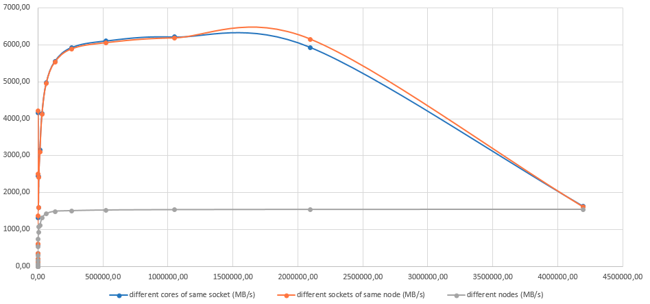

# Assignment 1

*by Andreas Peintner, Josef Gugglberger and Lukas Dötlinger*

## Exercise 1

### How to submit jobs, check status and delete jobs

* `qsub <script_file>`: submit a job to SGE
* `qstat`: check current state of a submitted job
* `qdel <job_id>`: delete submitted job from queue 

### Submission script

```
#!/bin/bash

#Excecute job in the queue "std.q" unless you have special requirements.
#$ -q std.q

# The batch system should use the current directory as working directory.
#$ -cwd

# Name your job. Unless you use the -o and -e options, output will
# go to a unique file name.ojob_id for each job.
#$ -N my_test_job

# Redirect output stream to this file.
#$ -o output.dat

# Join the error stream to the output stream.
#$ -j yes

# 2 slots per node, 8 slots in total
#$ -pe openmpi-2perhost 8

# load module
module load openmpi/4.0.1

# start script
mpiexec -n 8 /bin/hostname
```

### 5 most important qsub parameters

1. `-help` qsub help screen
2. `-q` queue: submit job to specefic queue
3. `-pe` parallel environment: set up parallel environment
4. `-o` to specify the output file
5. `-cwd` to execute job in current working directory (defaults to `$HOME`)

### How to run a MPI program in parallel

The line `#$ -pe openmpi-2perhost 8` in the job script sets up the parallel environment. The line as it is means: reserve 8 cores in total, with each used node having a maximum of 2 CPU/core slots. To actually start your program in parallel, the job script needs to be executed with the command `mpiexec -n 8 <script_file>`. The `-n` flag is set to 8, which executes the command/program 8 times (i.e. starts 8 processes).

## Exercise 2

### Observed effects

When increasing the number of messages in the test, the latency also increases on a linear basis. While the bandwidth overall increases aswell, it doesn't really do that in a linear way. 

Although this effect is to be expected, we can see that the results for latency don't really change until we hit an amount of 100 messages or so. Another interesting behaviour we observed is the fluctuation in bandwith-measurements, when running both processes on the same node.

As expected the latency between two cores of the same node is smaller than between two nodes. But with increasing size the difference becomes less (see chart below). While at a low size, the latency between two cores is roughly ten times smaller than between two nodes, at a large size the factor between them is only ~1.1. A similar effect can also be seen in the bandwith measurements.




### The modified experiment
With the ```-binding``` parameter it is possible to set specific core bindings (source: http://gridscheduler.sourceforge.net/htmlman/htmlman1/qsub.html).

To run the two processes (MPI ranks) on different cores of the same socket, we use
```shell
qsub -binding explicit:0,0:0,1 -pe openmpi-2perhost 2 script.sh
```

To run the two processes (MPI ranks) on different sockets of the same node, we use
```shell
qsub -binding explicit:0,0:1,0 -pe openmpi-2perhost 2 script.sh
```

To run the two processes (MPI ranks) on different nodes, we use
```shell
qsub -pe openmpi-1perhost 2 script.sh
```

### Verify rank placement

To verify rank placement, we use the parameter `-display-allocation` and `-display-map` with `mpiexec`.

* `-display-allocation` shows the allocated resources on each of the used nodes
* `-display-map` shows all the mapped locations (socket and cpu core) for each process prior to launch

### Measured data

* bandwidth between different cores of same socket:

| Size      | Bandwidth (MB/s)   |
| --------: | -----------------: |
| 1       |    4.26 |
| 2       |    8.67 |
| 4       |   17.33 |
| 8       |   34.21 |
| 16      |   61.20 |
| 32      |  123.70 |
| 64      |  207.78 |
| 128     |  349.22 |
| 256     |  592.99 |
| 512     | 1324.06 |
| 1024    | 2450.11 |
| 2048    | 4156.24 |
| 4096    | 1586.01 |
| 8192    | 2429.82 |
| 16384   | 3151.97 |
| 32768   | 4147.91 |
| 65536   | 4973.10 |
| 131072  | 5554.64 |
| 262144  | 5932.29 |
| 524288  | 6107.04 |
| 1048576 | 6214.19 |
| 2097152 | 5933.88 |
| 4194304 | 1634.46 |

* bandwidth between different sockets of same node:

| Size      | Bandwidth (MB/s)   |
| --------: | -----------------: |
| 1       |    4.35 |
| 2       |    8.76 |
| 4       |   17.62 |
| 8       |   35.14 |
| 16      |   60.84 |
| 32      |  123.72 |
| 64      |  208.77 |
| 128     |  357.32 |
| 256     |  612.12 |
| 512     | 1364.25 |
| 1024    | 2502.65 |
| 2048    | 4215.30 |
| 4096    | 1589.86 |
| 8192    | 2417.88 |
| 16384   | 3096.59 |
| 32768   | 4128.32 |
| 65536   | 4965.63 |
| 131072  | 5533.68 |
| 262144  | 5894.48 |
| 524288  | 6059.00 |
| 1048576 | 6187.72 |
| 2097152 | 6156.45 |
| 4194304 | 1616.92 |

* bandwidth between different nodes:

| Size      | Bandwidth (MB/s)   |
| --------: | -----------------: |
| 1       |    0.63 |
| 2       |    1.27 |
| 4       |    2.53 |
| 8       |    5.11 |
| 16      |   10.25 |
| 32      |   20.49 |
| 64      |   40.68 |
| 128     |   77.88 |
| 256     |  153.29 |
| 512     |  294.33 |
| 1024    |  537.06 |
| 2048    |  745.94 |
| 4096    |  924.45 |
| 8192    | 1064.08 |
| 16384   | 1104.19 |
| 32768   | 1306.28 |
| 65536   | 1420.98 |
| 131072  | 1485.48 |
| 262144  | 1502.98 |
| 524288  | 1520.07 |
| 1048576 | 1529.99 |
| 2097152 | 1535.60 |
| 4194304 | 1537.98 |

* latency between cores of same socket:

| Size      |  Latency (us)   |
| --------: | -----------------: |
| 0       |    0.41 |
| 1       |    0.46 |
| 2       |    0.46 |
| 4       |    0.46 |
| 8       |    0.47 |
| 16      |    0.49 |
| 32      |    0.48 |
| 64      |    0.53 |
| 128     |    0.56 |
| 256     |    0.60 |
| 512     |    0.88 |
| 1024    |    1.01 |
| 2048    |    1.30 |
| 4096    |    3.94 |
| 8192    |    4.86 |
| 16384   |    6.57 |
| 32768   |    9.18 |
| 65536   |   14.50 |
| 131072  |   24.88 |
| 262144  |   45.64 |
| 524288  |   87.21 |
| 1048576 |  177.90 |
| 2097152 | 1287.09 |
| 4194304 | 2894.17 |

* latency between different sockets of same node:

| Size      | Latency (us)   |
| --------: | -----------------: |
| 0       |    0.43 |
| 1       |    0.48 |
| 2       |    0.48 |
| 4       |    0.48 |
| 8       |    0.48 |
| 16      |    0.50 |
| 32      |    0.50 |
| 64      |    0.55 |
| 128     |    0.57 |
| 256     |    0.61 |
| 512     |    0.88 |
| 1024    |    1.03 |
| 2048    |    1.32 |
| 4096    |    4.03 |
| 8192    |    4.97 |
| 16384   |    6.64 |
| 32768   |    9.23 |
| 65536   |   14.52 |
| 131072  |   25.06 |
| 262144  |   45.94 |
| 524288  |   90.42 |
| 1048576 |  185.25 |
| 2097152 | 1307.03 |
| 4194304 | 2901.13 |

* latency between different nodes:

| Size      | Latency (us)   |
| --------: | -----------------: |
| 0       |    3.50 |
| 1       |    3.55 |
| 2       |    3.55 |
| 4       |    3.55 |
| 8       |    3.61 |
| 16      |    3.63 |
| 32      |    3.67 |
| 64      |    3.84 |
| 128     |    4.84 |
| 256     |    5.35 |
| 512     |    6.25 |
| 1024    |    7.43 |
| 2048    |    9.97 |
| 4096    |   12.61 |
| 8192    |   18.46 |
| 16384   |   26.24 |
| 32768   |   36.68 |
| 65536   |   57.71 |
| 131072  |  100.57 |
| 262144  |  187.17 |
| 524288  |  358.09 |
| 1048576 |  698.74 |
| 2097152 | 1379.51 |
| 4194304 | 2746.77 |

