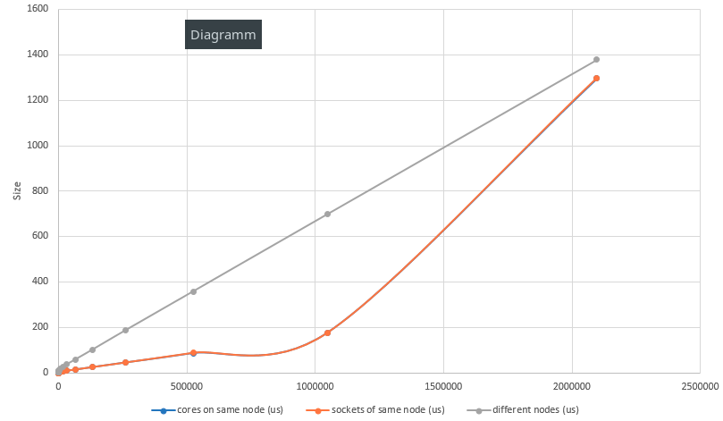

# Assignment 1

*by Andreas Peintner, Josef Gugglberger and Lukas Dötlinger*

## Exercise 1

### How to submit jobs, check status and delete jobs

* `qsub <script_file>`: submit a job to SGE
* `qstat`: check current state of a submitted job
* `qdel <job_id>`: delete submitted job from queue 

### Submission script

```
#!/bin/bash

#Excecute job in the queue "std.q" unless you have special requirements.
#$ -q std.q

# The batch system should use the current directory as working directory.
#$ -cwd

# Name your job. Unless you use the -o and -e options, output will
# go to a unique file name.ojob_id for each job.
#$ -N my_test_job

# Redirect output stream to this file.
#$ -o output.dat

# Join the error stream to the output stream.
#$ -j yes

# 2 slots per node, 8 slots in total
#$ -pe openmpi-2perhost 8

# load module
module load openmpi/4.0.1

# start script
mpiexec -n 8 /bin/hostname
```

### 5 most important qsub parameters

1. `-help` qsub help screen
2. `-q` queue: submit job to specefic queue
3. `-pe` parallel environment: set up parallel environment
4. `-o` to specify the output file
5. `-cwd` to execute job in current working directory (defaults to `$HOME`)

### How to run a MPI program in parallel

The line `#$ -pe openmpi-2perhost 8` in the job script sets up the parallel environment. The line as it is means: reserve 8 cores in total, with each used node having a maximum of 2 CPU/core slots. To actually start your program in parallel, the job script needs to be executed with the command `mpiexec -n 8 <script_file>`. The `-n` flag is set to 8, which executes the command/program 8 times (i.e. starts 8 processes).

## Exercise 2

### Measured data

* bandwidth between different cores of same node:
```
# Size      Bandwidth (MB/s)
1                       4.26
2                       8.67
4                      17.33
8                      34.21
16                     61.20
32                    123.70
64                    207.78
128                   349.22
256                   592.99
512                  1324.06
1024                 2450.11
2048                 4156.24
4096                 1586.01
8192                 2429.82
16384                3151.97
32768                4147.91
65536                4973.10
131072               5554.64
262144               5932.29
524288               6107.04
1048576              6214.19
2097152              5933.88
4194304              1634.46
```

* bandwidth between sockets of same node:
```
# Size      Bandwidth (MB/s)
TODO
```

* bandwidth between different nodes:

```
# Size      Bandwidth (MB/s)
1                       0.62
2                       0.26
4                       0.49
8                       1.02
16                      2.08
32                      2.35
64                      7.86
128                    10.07
256                    32.94
512                    39.85
1024                  189.31
2048                   74.80
4096                  191.04
8192                  105.01
16384                 157.89
32768                 217.67
65536                 213.95
131072                257.57
262144                413.24
524288                681.58
1048576               760.14
2097152               963.52
4194304              1238.17
```

* latency between cores of same node:
```
# Size          Latency (us)
0                       0.40
1                       0.46
2                       0.46
4                       0.46
8                       0.46
16                      0.48
32                      0.49
64                      0.53
128                     0.57
256                     0.61
512                     0.87
1024                    1.02
2048                    1.32
4096                    4.06
8192                    4.88
16384                   6.63
32768                   9.19
65536                  14.46
131072                 25.06
262144                 45.82
524288                 87.36
1048576               177.77
2097152              1297.33
```

* latency between sockets of same node:
```
# Size          Latency (us)
0                       0.43
1                       0.46
2                       0.46
4                       0.46
8                       0.47
16                      0.48
32                      0.49
64                      0.52
128                     0.56
256                     0.59
512                     0.87
1024                    1.01
2048                    1.31
4096                    4.01
8192                    4.90
16384                   6.62
32768                   9.23
65536                  14.52
131072                 24.91
262144                 45.63
524288                 88.14
1048576               177.09
2097152              1297.91
4194304              2880.99
```

* latency between different nodes:
```
# Size          Latency (us)
0                       3.50
1                       3.56
2                       3.53
4                       3.55
8                       3.60
16                      3.63
32                      3.66
64                      3.83
128                     4.82
256                     5.34
512                     6.12
1024                    7.17
2048                    9.93
4096                   12.56
8192                   18.50
16384                  26.18
32768                  36.64
65536                  57.73
131072                100.49
262144                187.19
524288                357.98
1048576               699.26
2097152              1379.17
```

### Observed effects

When increasing the number of messages in the test, the latency also increases on a linear basis, while the bandwidth decreases. 

Although this effect is to be expected, we can see that the results for both bandwidth and latency don't really change until we hit an amount of 100 messages or so.

As expected the latency between two cores of the same node is smaller than between two nodes. But with increasing size the difference becomes less (see chart below). While at a low size, the latency between two cores is roughly ten times smaller than between two nodes, at a large size the factor between them is only ~1.1. A similar effect can also be seen in the bandwith measurements.



### The modified experiment
With the ```-binding``` parameter it is possible to set specific core bindings (source: http://gridscheduler.sourceforge.net/htmlman/htmlman1/qsub.html).

To run the two processes (MPI ranks) on different cores of the same socket, we use
```shell
qsub -binding linear:2 -pe openmpi-2perhost 2 script.sh
```

TODO: To run the two processes (MPI ranks) on different sockets of the same node, we use
```shell
qsub -binding striding:2:4 -pe openmpi-2perhost 2 script.sh
```

To run the two processes (MPI ranks) on different nodes, we use
```shell
qsub -pe openmpi-1perhost 2 script.sh
```
