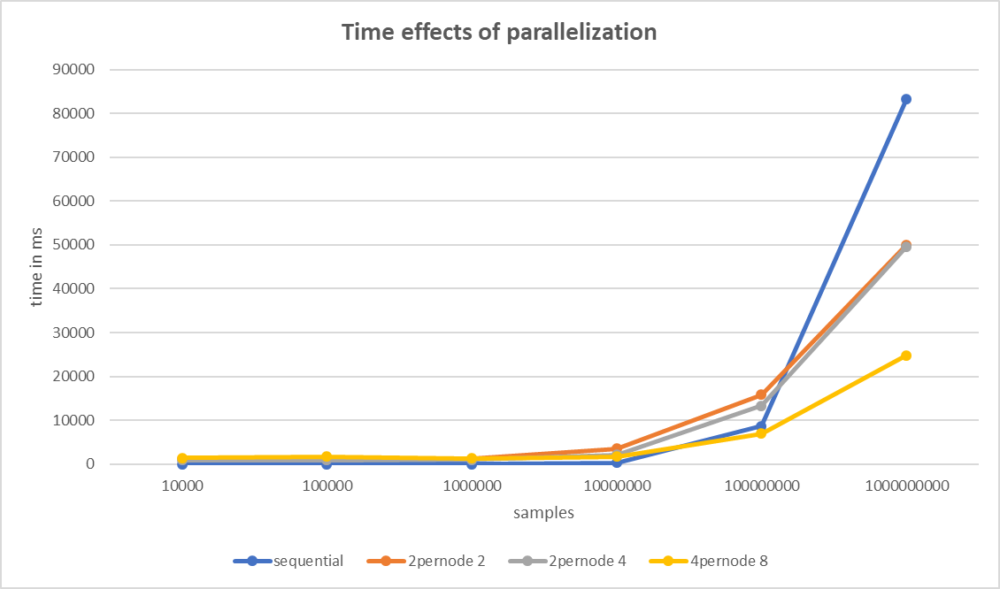
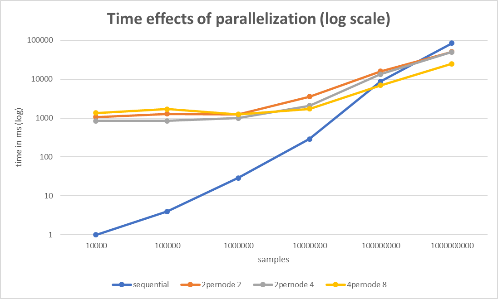
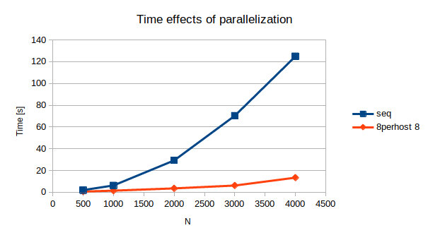

# Assignment 2, due October 23rd 2019

The goal of this assignment is to implement some basic MPI applications.

*by Andreas Peintner, Josef Gugglberger and Lukas Dötlinger*

### How to execute

Navigate into an exercise-direcotry and run `make` to build the executables. 

To submit a job to SGE, use the provided script like this:
```shell
qsub -sync yes -pe openmpi-8perhost 8 job.sh -n 8 -p '<executable> <param for computation>'
```

## Exercise 1

This exercise consists of writing a parallel application to speed up the computation of π.

### Description

There are many ways of approximating π, one being a well-known Monte Carlo method: The ratio of the areas of a square and its incircle is π/4. Since the exact area of a circle cannot be computed (we don't know the value of π yet), one can instead sample random points, check their distance from the center and compute the ratio of points inside the circle to all sampled points.


### Consider a parallelization strategy using MPI. Which communication pattern(s) would you choose and why?

We thought that the simplest approach would be using the `MPI_Reduce` function. `MPI_Reduce` can collect values from the ranks and aggregate them. With `MPI_SUM` as an aggregation function, this is exactly what we need in this case. We collect the values that are outside of the circle at each node, sum them up, and in the root rank, we then calculate *pi* by dividing the collected value with the overall sample number (and multiplying by 4).

Our implementation was influenced by following tutorial: https://www.olcf.ornl.gov/tutorials/monte-carlo-pi/.

### Accuracy effects of parallelization

| samples | sequential | 2perhost 8 | δ sequential | δ 2perhost 8 |
| -: | -: | -: | -: | -: |
| 10.000 | 3.134487 | 3.147200 | 0.0071 | 0.056 |
| 100.000 | 3.149609 | 3.140320 | 0.008017 | 0.001272 |
| 1.000.000 | 3.143745 | 3.141460 | 0.0022 | 0.002153 |
| 10.000.000 | 3.140680 | **3.141502** | 0.000912 | **0.00009** |

### Time effects of parallelization

| samples | sequential | 2perhost 2 | 2perhost 4 | 2perhost 8 |
| -: | -: | -: | -: | -: |
| 10.000 | **1ms** | 1064ms | 846ms | 1360ms |
| 100.000 | **4ms** | 1277ms | 850ms | 1688ms |
| 1.000.000 | **29ms** | 1223ms | 996ms | 1255ms |
| 10.000.000 | **289ms** | 3541ms | 2065ms | 1719ms |
| 100.000.000 | 8685ms | 15870ms | 13317ms | **6935ms** |
| 1.000.000.000 | 83326ms | 50032ms | 49660ms | **24808ms** |




## Exercise 2

This exercise consists in parallelizing an application simulating the propagation of heat.

Our solution was inspired by the following approach: https://people.sc.fsu.edu/~jburkardt/c_src/heat_mpi/heat_mpi.html

### Tasks

- A sequential implementation of a 1-D heat stencil is available in [heat_stencil_1D_seq.c](heat_stencil_1D/heat_stencil_1D_seq.c). Read the code and make sure you understand what happens. See the Wikipedia article on [Stencil Codes](https://en.wikipedia.org/wiki/Stencil_code) for more information.
- Consider a parallelization strategy using MPI. Which communication pattern(s) would you choose and why? Are there additional changes required in the code beyond calling MPI functions? If so, elaborate!
- Implement your chosen parallelization strategy as a second application `heat_stencil_1D_mpi`. Run it with varying numbers of ranks and problem sizes and verify its correctness by comparing the output to `heat_stencil_1D_seq`.
- Discuss the effects and implications of your parallelization.

### Parallelization strategy

We split the problem size `N` between all ranks. Therefore we get a different area of the 1D room for each of the ranks. When computing the heat distribution, each rank needs to know the values at it's left and right border, for every timestamp ìn `T`.

Before entering the temp-calculation for a timestamp, a rank uses **no-blocking** mpi-send to give its neighbours the values which they need to know (i.e., rank3 would send it's first value to rank2 and it's last to rank5). To obtain a value from another ranks area, we use **blocking** mpi-recieve. 

In the end, **blocking** mpi-send and -recieve are used to send all areas to the main rank. 

In the parallel algorithm, we had to omit the printing of intermediate results, because we don't have a consistent array after each time unit. Every rank is at a different position in computing and reports his array only at the end to rank 0, therefore we cannot show intermediate results.

### Time measurements

We where not able to measure results with other parallel environments than `8perhost 8`, because they all end up in a deadlock.

| N | sequential [s] | 8perhost 8 [s] |
| -: | -: | -: |
| 500 | 1.91016 | 0.571594 |
| 1000 | 6.1721 | 1.40361 |
| 2000 | 29.2026 | 3.48575 |
| 3000 | 70.2959 | 6.11116 |
| 4000 | 124.933 | 13.3618 |



