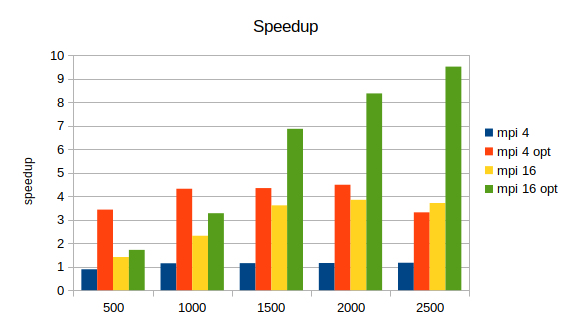

# Assignment 6

*by Andreas Peintner, Josef Gugglberger and Lukas Dötlinger*

## Exercise 1

### Tasks

- Provide an implementation of your parallelization and optimization plan for the n-body simulation of Assignment 5.
- Measure the speedup and efficiency for multiple problem and machine sizes as in previous exercises.
- Illustrate the data in appropriate figures and discuss them. What can you observe?

### Implementation

In assignment 5 we presented two approaches for optimizing the sequential implementation of the n-body problem. The first optimization was to compute the force between two particles only once, instead of twice (in each direction). The second optimization was to define a threshold distance between particles, and if this threshold is exceeded we do not calculate the forces because they will be negligable.

Further we presented two different approaches for parallelization, splitting the area or splitting the problem size.

In this exercise we implemented the two optimizations for the sequential version and the MPI version with the problem size split. We tested both version with an without the optimizations described above (and in more detail in assignment 5).

We have four implementations:
- `nbody_seq`, a sequential version
- `nbody_seq_opt`, a sequential optimized version
- `nbody_mpi_1`, an unoptimized mpi version
- `nbody_mpi_1_opt`, the optimized mpi version

### Measurements 

All tests were done on `lcc2` with 1000 timesteps.

| particles | seq [s] | seq opt [s] | mpi (4 ranks) [s] | 4 mpi opt (4 ranks) [s] | mpi (16 ranks) [s] | mpi opt (16 ranks) [s]|
| -: | -: | -: | -: | -: | -: | -: |
| 500 | 8.3 | 2.4 | 2.7 | 0.7 | 1.7 | 1.4 |
| 1000 | 32.1 | 9.5 | 8.3 | 2.2 | 4.1 | 2.9 |
| 1500 | 71.8 | 21.3 | 18.5 | 4.9 | 5.9 | 3.1 |
| 2000 | 127.7 | 37.7 | 32.6 | 8.4 | 9.8 | 4.5 |
| 2500 | 199.3 | 59 | 50.6 | 17.8 | 15.9 | 6.2 |

### Figures

