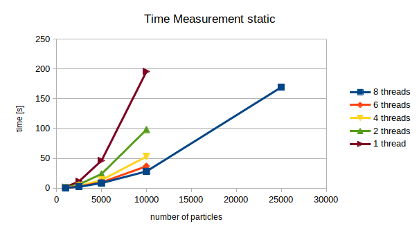
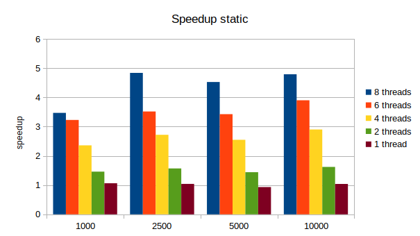
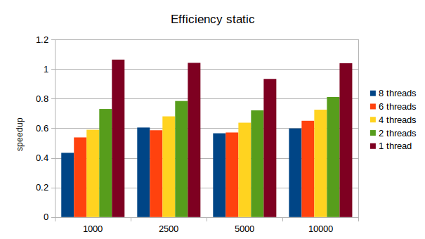
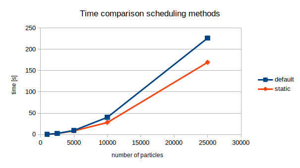
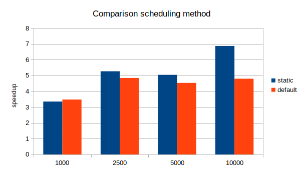

# Assignment 7

*by Andreas Peintner, Josef Gugglberger and Lukas Dötlinger*

## Exercise 1

### Tasks

- Study the OpenMP `parallel` and `for` pragmas and attempt to parallelize the n-body simulation using OpenMP. If you have multiple sequential implementations of n-body, you are free to choose one. Also, study how to submit OpenMP jobs on LCC2.
- Measure the execution time of your OpenMP program for several problem sizes and for 1 to 8 threads.
- Illustrate the data in appropriate speedup/efficiency figures and discuss them. What can you observe?

### Implementation

To parallelize our n-body application we add the statement `#pragma omp parallel for private(j) schedule(static, 100)` (line 43) to our n-body implementation of assignment 6. While the *explicitly* written down line seems to be very simple, *impliclitly* there is going on much here. At first the directive `pragma omp parallel for` is some syntactic sugar, which opens a `parallel` region that contains a single `for` directive (so you save one line + curly brackets for the parallel region). The iteration variable of the inner loop, `j`, is declared private, meaning that each thread has a local copy of that variable. The iteration variable of the outer loop, `i`, is private per default (defined by the `for` directive). Variables declared outside the scope of the parallel region are shared per default in the parallel region. The `schedule` clause is used for distributing the data more evenly across the threads. If there are `T` threads, then in the default case the first rank gets the first `N/T` particles and so on. If static scheduling is used, the data is distributed based on the schedule chunk size (100 in our case). The first thread takes the first 100 elements, the second thread the next 100 elements and so on. This kind of scheduling is beneficial for our case because we do more computation in the first half of the iteration (in the second half we just flip the sign in the computation). We compared the default scheduling with static scheduling in our measurements below.

### Instructions

Our parallelized application of the n-body problem can be executed on LCC2 with the following line:

```
qsub -sync yes -pe openmp T job.sh -n T -p 'nbody2d_omp N [--verbose]'
```

where `T` represents the number of threads that should be assigned to the job, and `N` represents how many particles should be generated. If `---verbose` is specified, the particles are printed at every timestep.

### Measurements 

We provide a small benchmark via the shell script [benchmark.sh](./benchmark.sh). For running a benchmark execute:

```
./benchmark.sh 'nbody2d_omp N'
```
where `N` represents the number of particles.

All tests were done on LCC2 with 1000 timesteps. The data is provided in [this](./measurements/measurements.ods) spreadsheet.


### Figures










