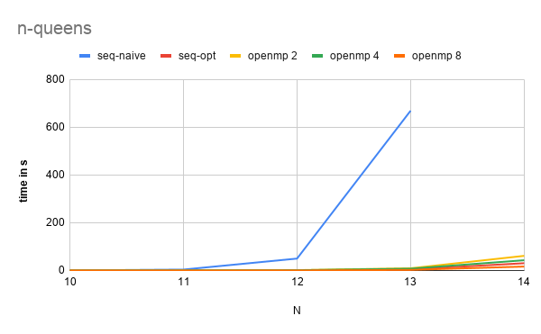
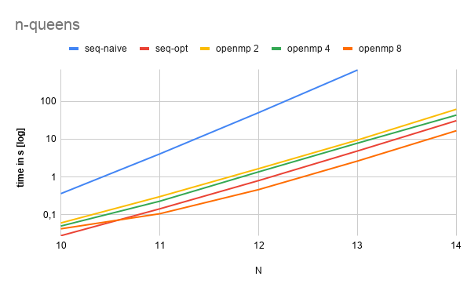
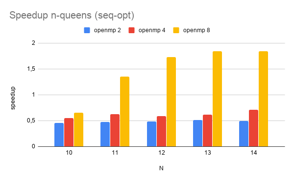
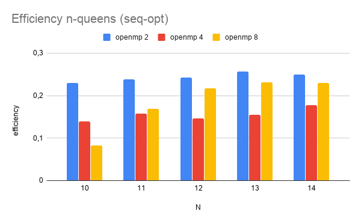

# Assignment 9, due December 11th 2019

*by Andreas Peintner, Josef Gugglberger and Lukas Dötlinger*

## Exercise 1

This exercise is about the n-queen problem. Goal is to provide a sequential and a parallelized version with OpenMP, do some benchmarks and think of additional optimizations.

### Sequential version

We implemented the n-queens problem with a technique called backtracking. Backtracking algorithms compute solutions by taking previous steps into account. The idea is to place a queen on the board, and then search for the next valid position for the next queen. 

We also implemented a naive brute force algorithm for comparison, which does not only compute valid solutions, but instead, generates all possibilites. Afterwards we only print the subset valid solutions.

### Parallel version

Since this is a classic backtracking algorithm we can't just use `omp parallel for` and call it a day.
Therefore we used the following OpenMP constructs:
 - `omp parallel`
 - `omp single`
 - `omp task`
 - `omp critical`

The idea is to start the first step of solving the problem with `omp single` inside a parallel block. Within the solving function, we use recursive calls with `omp task`, so other threads also start solving. Hence the recursive calls will be executed in parallel.

When printing a solution, we use `omp critical`, so only one thread will print at a time.

### Measurements

| N | seq-naive [s] | seq-opt [s] | OpenMP 2 [s] | OpenMP 4 [s] | OpenMP 8 [s] |
| -: | -: | -: | -: | -: | -: | 
| 10 | 0.36 s | 0.027 s | 0.06 s | 0.05 s | 0.04 s |
| 11 | 4.05 s | 0.143 s | 0.3 s | 0.22 s | 0.1 s |
| 12 | 50.1 s | 0.801 s | 1.65 s  | 1.36 s | 0.46 s |
| 13 | 669.5 s | 4.85 s | 9.44 s | 7.81 s | 2.63 s |
| 14 | xx | 30,6 s | 61.54 s | 43.12 s | 16.66 s |

Speed up and efficiency will be calculated dependent of the optimized sequential approach, since no time measurements of bigger problem sizes for the naive approach are available.

### Resources 

* https://rosettacode.org/wiki/N-queens_problem#C
* https://stackoverflow.com/questions/3184893/use-next-permutation-to-permutate-a-vector-of-classes
