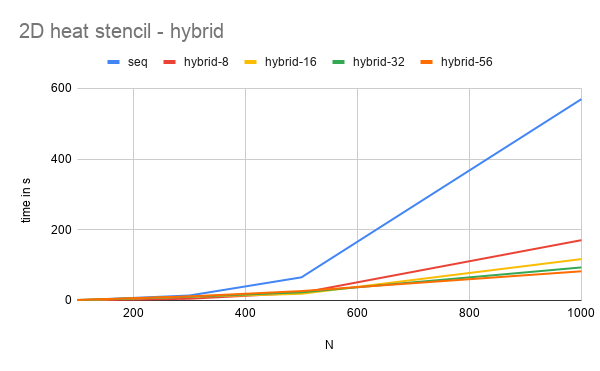
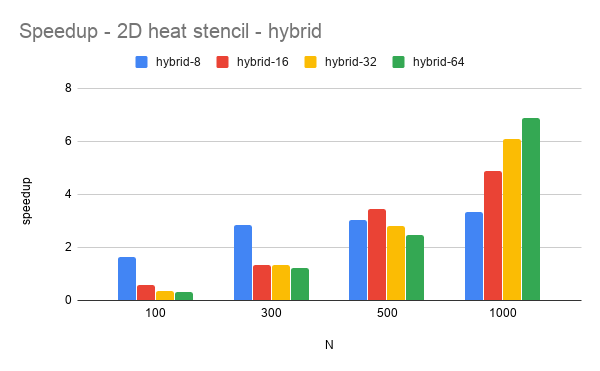
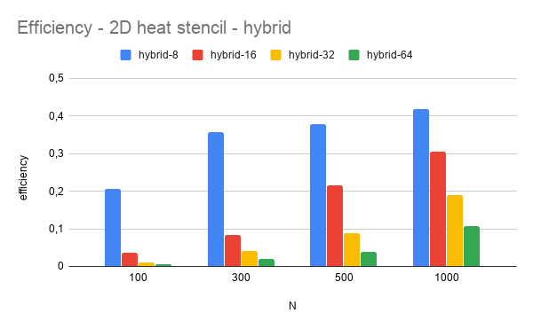
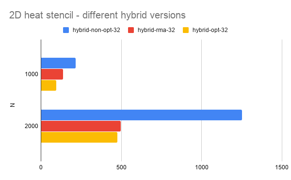

# Assignment 10, due January 8th 2020

*by Andreas Peintner, Josef Gugglberger and Lukas Dötlinger*

The goal of this assignment is to write a hybrid MPI/OpenMP application.

## Exercise 1

### Tasks

- Implement a hybrid MPI/OpenMP parallel version of the 2D heat stencil.
- Use at least two specific performance optimizations (one for intra-node performance, one for inter-node performance) that were discussed in the lecture so far.
- Benchmark your problem for several problem sizes, numbers of threads and numbers of nodes. Include experiments with all nodes/cores. What can you observe?
- For at least one larger problem size / number of threads / number of nodes combination, benchmark and compare all four cases of a) no optimization b) MPI optimization only c) OpenMP optimization only d) both. What can you observe?

### Hybrid Job Submission

- https://wiki.uiowa.edu/display/hpcdocs/Advanced+Job+Submission

### Optimizations

#### Intra-node Performance

Using only 1-dimensional buffers, instead of 2-dimensional buffers (vector of vector), optimizes the intra-node performance.

#### Inter-node Performance

We decomposed the domain into **slabs**. This minimized the communication overhead, because only two buffers (upper and lower) are left to be used.

#### RMA

Since our original approach was by chance the most optimized version for a hybrid application, we decided to implement remote memory access instead. However, the RMA version is slightly slower then our optimized original version. In our opinion buffering and synchronisation at *win_fence* calls are the reason for this.

### Measurements

#### Optimized Hybrid Version

| N | seq [s] | hybrid-8 [s] | hybrid-16 [s] | hybrid-32 [s] | hybrid-56 [s]
| -: | -: | -: | -: | -: | -: |
| 100 | 0,54300 | 0,329 | 0,95 | 1,465 | 1,651
| 300 | 14,187 | 4,97 | 10,528 | 10,626 | 11,594
| 500 | 65,526 | 21,715 | 19,023 | 23,312 | 26,715
| 1000 | 569,443 | 170,648 | 117,085 | 93,555 | 82,657

#### Different Versions

| N | hybrid-non-opt-32 [s] | hybrid-rma-32 [s] | hybrid-opt-32 [s]
| -: | -: | -: | -: |
| 1000 | 216,8 | 136,484 | 93,555
| 2000 | 1250,35 | 496,129 | 475,293

