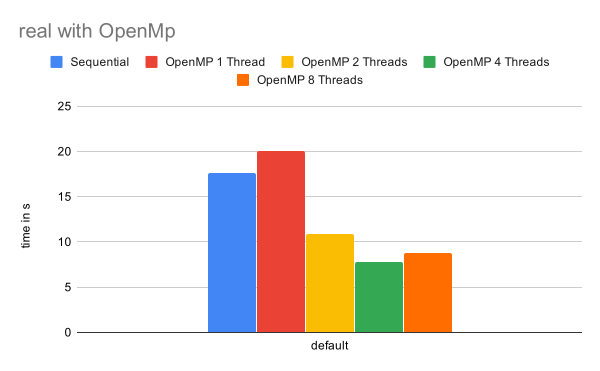
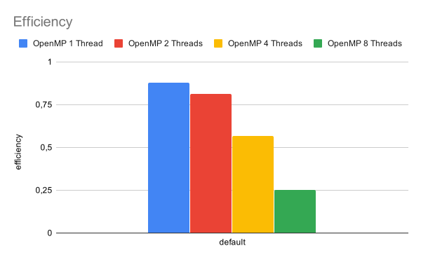

# Assignment 11, due January 15th 2020

*by Andreas Peintner, Josef Gugglberger and Lukas Dötlinger*

The goal of this assignment is to parallelize an unknown application using profiling and OpenMP.

## Exercise 1

Use tools like **gprof**, **gperftools**, **perf** (not working with WSL :( <-- Therefore, for God's sake, you should use **Linux** ;) ), etc. to analyze the program real_omp. Based on the results, optimize the program with OpenMP.

### gprof

GNU profiler gprof tool uses a hybrid of instrumentation and sampling. Instrumentation is used to collect function call information, and sampling is used to gather runtime profiling information [[1]](https://euccas.github.io/blog/20170827/cpu-profiling-tools-on-linux.html).


#### How to use:

* compile with debug symbols (-g) and gprofsupport (-pg)

* Then use `gmon.out` file to show results:

```
gprof real_omp gmon.out --line      # --line to get more details
```


Windows (WSL) output:
```
| %    | cumulative | self    | self   | total   |         |                                |
|------|------------|---------|--------|---------|---------|--------------------------------|
| time | seconds    | seconds | calls  | Ts/call | Ts/call | name                           |
| 0.00 | 0.00       | 0.00    | 131642 | 0.00    | 0.00    | randlc (randdp.c:5 @ aa70)     |
| 0.00 | 0.00       | 0.00    | 131072 | 0.00    | 0.00    | vranlc (randdp.c:72 @ ab40)    |
| 0.00 | 0.00       | 0.00    | 493    | 0.00    | 0.00    | setup (real_omp.c:330 @ 1e60)  |
| 0.00 | 0.00       | 0.00    | 168    | 0.00    | 0.00    | psinv (real_omp.c:451 @ 67d0)  |
| 0.00 | 0.00       | 0.00    | 147    | 0.00    | 0.00    | interp (real_omp.c:653 @ 8010) |
| 0.00 | 0.00       | 0.00    | 147    | 0.00    | 0.00    | resid (real_omp.c:513 @ 5a50)  |
| 0.00 | 0.00       | 0.00    | 147    | 0.00    | 0.00    | rprj3 (real_omp.c:572 @ 7520)  |
```

Linux output:
```
  %   cumulative   self              self     total           
 time   seconds   seconds    calls  Ts/call  Ts/call  name    
  8.92      0.53     0.53                             resid (real_omp.c:534 @ 5d20)
  4.59      0.80     0.27                             resid (real_omp.c:538 @ 5ee6)
  3.91      1.03     0.23                             resid (real_omp.c:532 @ 5d2b)
  3.06      1.21     0.18                             resid (real_omp.c:531 @ 5d00)
  3.06      1.39     0.18                             resid (real_omp.c:534 @ 5d42)
  3.06      1.57     0.18                             vranlc (randdp.c:135 @ b47a)
  2.89      1.74     0.17                             resid (real_omp.c:546 @ 5ef5)
  2.80      1.90     0.17                             resid (real_omp.c:545 @ 5efb)
  2.72      2.06     0.16                             vranlc (randdp.c:136 @ b48e)
  2.72      2.22     0.16                             vranlc (randdp.c:132 @ b451)
  2.55      2.37     0.15                             comm3 (real_omp.c:877 @ 309f)
  2.38      2.51     0.14                             psinv (real_omp.c:472 @ 68d7)
  2.29      2.65     0.14                             resid (real_omp.c:532 @ 5d0c)
  2.21      2.78     0.13                             resid (real_omp.c:537 @ 5f2f)
  ...
  ```

### gpertools

- Tutorial for WSL: https://github.com/usnistgov/OOF2/issues/6 (Step 3)
- link with –lprofiler
- run with environment variable CPUPROFILE=prof.out
- run pprofbinary prof.out to view results (--gv for graphical visualization)

#### How to use [[2]](https://wiki.geany.org/howtos/profiling/gperftools):

```
LD_PRELOAD=/usr/lib/libprofiler.so CPUPROFILE=prof.out ./real_omp   # start profiling
pprof --text ./real_omp prof.out                                    # show the resuls as text
pprof --web ./real_omp prof.out                                     # show the results in the browser
```

Text output:
```
Total: 589 samples
     231  39.2%  39.2%      231  39.2% resid
     105  17.8%  57.0%      105  17.8% vranlc
     104  17.7%  74.7%      104  17.7% psinv
      53   9.0%  83.7%       53   9.0% interp
      47   8.0%  91.7%       47   8.0% rprj3
      17   2.9%  94.6%       17   2.9% comm3.isra.0
      15   2.5%  97.1%       15   2.5% __memset_avx2_erms
      10   1.7%  98.8%       10   1.7% norm2u3
       4   0.7%  99.5%        4   0.7% __memset_avx2_unaligned_erms
       3   0.5% 100.0%        3   0.5% zran3.isra.0.constprop.0
       0   0.0% 100.0%       61  10.4% 0x00007f15fee3baf7
       0   0.0% 100.0%       61  10.4% 0x60663242d68bf6ff
       0   0.0% 100.0%      118  20.0% main

```

### perf

Uses CPU performance counters to profile (sampling tool).

#### How to use:

```
perf record ./real_omp      # creates file perf.data
perf report                 # show results
```

This gives following output:
```
Overhead  Command   Shared Object          Symbol
  38.54%  real_omp  real_omp               [.] resid
  17.95%  real_omp  real_omp               [.] vranlc
  17.01%  real_omp  real_omp               [.] psinv
   9.27%  real_omp  real_omp               [.] interp
   8.64%  real_omp  real_omp               [.] rprj3
```

### Measurements

| N | Sequential | OpenMP 1 Thread | OpenMP 2 Threads | OpenMP 4 Threads | OpenMP 8 Threads
| -: | -: | -: | -: | -: | -: |
| default | 17,601 | 20,068042 | 11,033795 | 8,068023 | 9,06459






### References

* https://euccas.github.io/blog/20170827/cpu-profiling-tools-on-linux.html

